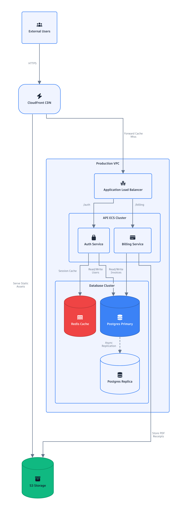
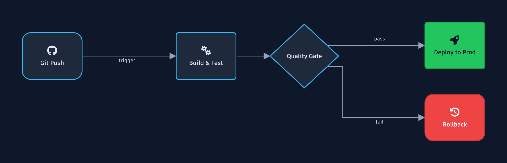

<div align="center">
  <h1>Glyphic</h1>
  <p><b>Machine-first diagramming infrastructure.</b></p>
  <p>Turn pure, semantic JSON into beautiful native SVG &amp; PNG diagrams — built for LLMs and autonomous agents, with no headless browser.</p>
</div>

<p align="center">
  <a href="#quick-start">Quick Start</a> ·
  <a href="./docs/examples/README.md">Examples Gallery</a> ·
  <a href="./docs/README.md">Documentation</a> ·
  <a href="#supported-diagrams">18 Diagram Types</a>
</p>

<p align="center">
  
  
</p>

---

## What

**Glyphic is infrastructure for generating diagrams from structured data.** You give it a strict, semantic JSON document — arrays of `nodes` and `edges`, or `entities`, or `commits` — and it returns a polished diagram as:

- **SVG** — pure, scalable vector markup (accessible: `role="img"` + `<title>`).
- **PNG** — high-resolution raster, rendered natively via Rust (`@resvg/resvg-js`).
- **React Flow JSON** — nodes/edges mapped for an interactive React Flow canvas.

It supports **18 diagram types** (architecture, sequence, ERD, UML class, state machines, flowcharts, Gantt, timelines, Sankey, Git trees, mindmaps, pie, quadrant, user journeys, Kanban, C4, treemaps, and a freeform canvas) behind a single validated schema.

You can use it three ways: as a **library** (`@glyphic/core`), as an **MCP server** (so Claude Desktop / Cursor can draw diagrams as a native tool), or as a **self-hosted HTTP API**.

## Why

If an LLM needs to produce a diagram today, it has two bad options:

1. **Draw raw SVG/Canvas.** LLMs have no visual cortex — ask one to place nodes by absolute coordinate and they overlap, text overflows, and connectors cut straight through other shapes.
2. **Emit a DSL like Mermaid.** Mermaid's syntax is finicky (`-->|label|`) and a single typo crashes the whole render. It also relies on a **headless browser (Puppeteer)** to run its layout, which is slow, heavy, and awkward to run server-side.

**Glyphic separates _semantics_ (what the diagram means) from _visuals_ (where things are drawn):**

- **Machine-first JSON, not a DSL.** The API surface is a strict [Zod](https://zod.dev) schema. Models emit ordinary JSON arrays — no fragile grammar to get wrong, and validation errors come back as precise, fixable messages instead of a crash.
- **Real layout engines, no DOM.** Routing, intersections, and sizing are computed by mathematical graph engines ([`elkjs`](https://github.com/kieler/elkjs) for graphs, [`d3-hierarchy`](https://github.com/d3/d3-hierarchy)/`d3-sankey` for data) — never a browser.
- **Native rasterization.** SVG is compiled to PNG by Rust (`@resvg/resvg-js`) directly in Node. Fast, light, and deployable anywhere — no Chromium.

The result: agents produce **correct, good-looking diagrams on the first try**, and you run it as a normal Node dependency.

## How

Pick the integration that fits you.

### 1. As a library

```bash
npm install @glyphic/core @glyphic/schema
```

```typescript
import { processDiagram } from "@glyphic/core";
import { writeFileSync } from "node:fs";

const result = await processDiagram({
  type: "architecture",
  title: "Web App",
  nodes: [
    { id: "web", label: "Web App", shape: "rounded", icon: "fab-react" },
    { id: "api", label: "API", shape: "hexagon", icon: "fas-bolt" },
    { id: "db", label: "PostgreSQL", shape: "database", icon: "fas-database" }
  ],
  edges: [
    { source: "web", target: "api", label: "REST" },
    { source: "api", target: "db", label: "SQL" }
  ]
});

writeFileSync("diagram.png", result.png);   // Buffer (high-res PNG)
writeFileSync("diagram.svg", result.svg);   // string (scalable SVG)
console.log(result.reactFlow);              // interactive React Flow JSON
```

See the [Core API reference](./docs/api.md).

### 2. As an MCP server (Claude Desktop / Cursor)

Add it to `claude_desktop_config.json`:

```json
{
  "mcpServers": {
    "glyphic": { "command": "npx", "args": ["-y", "@glyphic/mcp-server"] }
  }
}
```

Restart Claude Desktop and ask: *"Draw an architecture diagram of a React app behind an AWS load balancer talking to 3 Node services and a Postgres database."* Claude emits the JSON, calls the tool, and the rendered PNG appears inline. See the [MCP guide](./docs/mcp.md).

---

## Features

- 🧩 **18 diagram types** behind one validated schema — [see them all](#supported-diagrams).
- 🎨 **Theming** — built-in presets (`"theme": "dark"`, plus `light` / `pastel` / `mono`) or a full custom palette. [Theming guide](./docs/theming.md).
- 🖌️ **Styles** — visual personality presets: `"style": "compact"` (default), `clean`, `minimal`, or hand-drawn `sketch`. [Styles guide](./docs/styles.md).
- 📺 **Aspect-ratio framing** — auto-fits diagrams to clean 16:9 / 9:16 frames (or set `"aspectRatio"`), by padding — never cropping.
- 🔤 **Fonts** — any Google Font (`"fontFamily": "Outfit"`) or your own `.ttf`.
- 🖼️ **Native icons** — drop in any FontAwesome icon (`"icon": "fas-database"`, `"icon": "fab-aws"`) or your own SVG via `customIcons`.
- 📐 **Real layout** — `elkjs` + `d3` compute routing, nesting (VPCs/clusters), and crow's-foot/UML markers with no overlaps.
- ⚡ **Native PNG** — Rust rasterization, no headless browser.
- ♿ **Accessible output** — every SVG ships with `role="img"` and a `<title>`.
- 🔒 **Safe by construction** — strict input validation, SVG output escaping/sanitization, and size limits to resist malicious input.
- 🧪 **Multiple outputs** — SVG, high-res PNG, and React Flow JSON from one call.

## Supported Diagrams

18 first-class types — explore them in the **[Examples Gallery](./docs/examples/README.md)** and the **[Diagram Types reference](./docs/diagram-types.md)**.

| | | |
|---|---|---|
| **Architecture** (nested VPCs/clusters) | **C4** context | **Flowchart** |
| **Sequence** | **State** machine | **ERD** (crow's-foot) |
| **UML Class** | **Mindmap** | **Gantt** |
| **Timeline** | **User Journey** | **Kanban** |
| **Pie** | **Quadrant** | **Sankey** |
| **Git** graph | **Treemap** | **Canvas** (freeform SVG) |

## Monorepo architecture

A `pnpm` + Turborepo monorepo of three open-source libraries.

| Package | What it is |
|---|---|
| [`@glyphic/schema`](./packages/schema) | The pure Zod validation layer — the LLM-facing contract. Validate model output before rendering. |
| [`@glyphic/core`](./packages/core) | The engine: layout adapters, scene graph, SVG rendering, and rasterization. |
| [`@glyphic/mcp-server`](./packages/mcp-server) | Official Model Context Protocol server — exposes Glyphic as a native tool to Claude Desktop / Cursor. |

Adding a new diagram type is one entry in [`packages/core/src/registry.ts`](./packages/core/src/registry.ts) plus a schema and a layout adapter — see [CONTRIBUTING](./CONTRIBUTING.md).

## Documentation

- 📚 [Documentation home](./docs/README.md)
- 🖼️ [Examples gallery](./docs/examples/README.md) — every type, rendered
- 🧩 [Diagram types reference](./docs/diagram-types.md) — schema for all 18 types
- 🖌️ [Styles &amp; aspect-ratio framing](./docs/styles.md)
- 🎨 [Theming, fonts &amp; icons](./docs/theming.md)
- 🛠️ [Core API](./docs/api.md)
- 🔌 [MCP server](./docs/mcp.md)
- 🤝 [Contributing](./CONTRIBUTING.md)

## License

[LICENSE](./LICENSE). Build incredible things.
