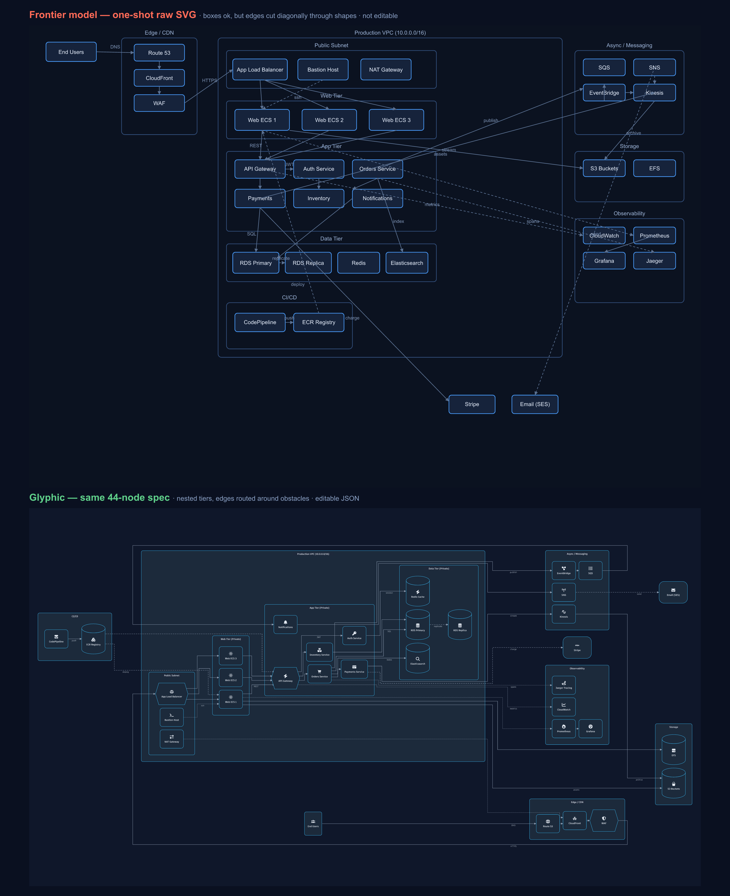

# Is the AI-diagram comparison fair? A note on method

> Companion post for the Glyphic launch — the "is the before/after rigged?" FAQ. Good to link
> from the Show HN thread. Suggested tags: `ai`, `llm`, `diagrams`, `showhn`.

Glyphic's homepage has a before/after: the same 44-node architecture, once as a frontier model's
one-shot raw SVG, once through Glyphic. It's the kind of image that invites a fair question —
*is this rigged?* So here's exactly how it was made, and why I think it's an honest test rather
than a strawman.

## Same model, same spec, two ways

Both images came from the **same model** (Claude Opus 4.8), in the **same session**, from the
**same brief** — a 44-node architecture with four nested tiers and 38 edges. The only thing that
changed was the *output boundary*:

- **Top:** I asked the model to hand-write the SVG directly — place every box and route every
  edge by coordinate.
- **Bottom:** I asked the same model to describe the same architecture as Glyphic's typed JSON,
  then let the engine (ELK for layout, resvg for rasterization) draw it.

That's deliberate. If I'd pitted one model's SVG against a *different* model's JSON, the result
would be a confound — you couldn't tell whether the difference came from the tool or the model.
Holding the model fixed removes that variable. **Same author, same content; only draw-vs-describe
differs.** That isn't a weakness of the comparison — it's the control.

## "Sure, but a better model would draw it fine"

This is the objection I'd raise too, and it's worth taking seriously. Try it with GPT-5, or
whatever's newest by the time you read this.

Here's why I don't think it changes the outcome: the part that breaks isn't a *language* problem.
Placing labeled boxes is something models already do well — the old "overlapping garbage"
complaint is dead. What breaks is **edge routing**: drawing connectors that go *around* obstacles
across a nested graph is global constraint optimization. It's the thing layout engines like ELK
exist to solve, and it isn't something you get incrementally better at by predicting the next
token — a model drawing SVG has to commit to `x`/`y` for every point with no way to backtrack over
the whole layout. So a better model gives you *nicer boxes*, not *untangled edges*; the failure
reproduces across models.

If you want to make this airtight for your own audience: regenerate the top image with two or
three different frontier models and caption it "same result across models." I couldn't call other
models from where I built this — but you can, and I'd expect the tangle every time past a couple
dozen nodes.

## One pass, no corrections

The raw SVG is the model's **first output, captured with no correction pass** — I didn't feed the
render back and ask it to fix the overlaps. That's the fair condition for how diagrams actually
get produced in agents and pipelines: one shot, no human nudging pixels.

To be completely upfront: if you *did* sit in a loop — render, look, "the Payments→Stripe edge
cuts through three boxes, move it" — a capable model could improve the routing over several turns.
That's real. But it's also not a workflow anyone wants: it's slow, it burns tokens, and it doesn't
scale to generating hundreds of diagrams. The whole point of handing layout to an engine is that
you get the clean result on the **first** try, deterministically, without babysitting.

## The takeaway

None of this is "AI can't make diagrams." It's that a *drawing* is the wrong output type. Ask the
model for the thing it's good at — a structured description of what the diagram means — and let a
real engine own the spatial math. The comparison isn't there to dunk on models; it's there to show
where the boundary should be.

Try the [live playground](https://glyphic.web.app/generate), or throw the same 44-node brief at
your favorite model as raw SVG and see for yourself.

*Glyphic is open source — [a star helps](https://github.com/MS-Teja/Glyphic), and feedback is very welcome.*
