# Examples Gallery

Every diagram below was produced by [`@glyphicjs/core`](../../packages/core) from pure JSON — no headless browser, no Mermaid. Click any `.json` link to see the exact input, or browse all source fixtures in this folder. For the field-by-field schema of each type, see the [Diagram Types reference](../diagram-types.md).

> All 18 first-class diagram types are represented. Diagrams render in the **compact** style and are auto-framed to 16:9 / 9:16 by default — see [Styles & Aspect-Ratio Framing](../styles.md).

---

## Render styles

The same diagram in different `style` presets (default is **compact**). See the [styles guide](../styles.md).

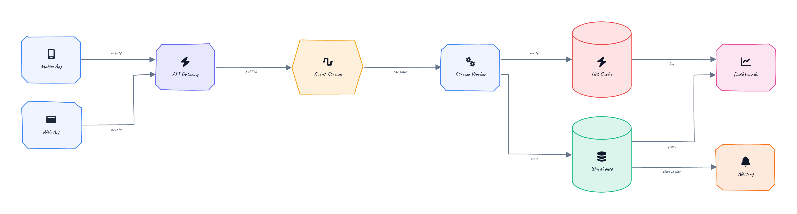

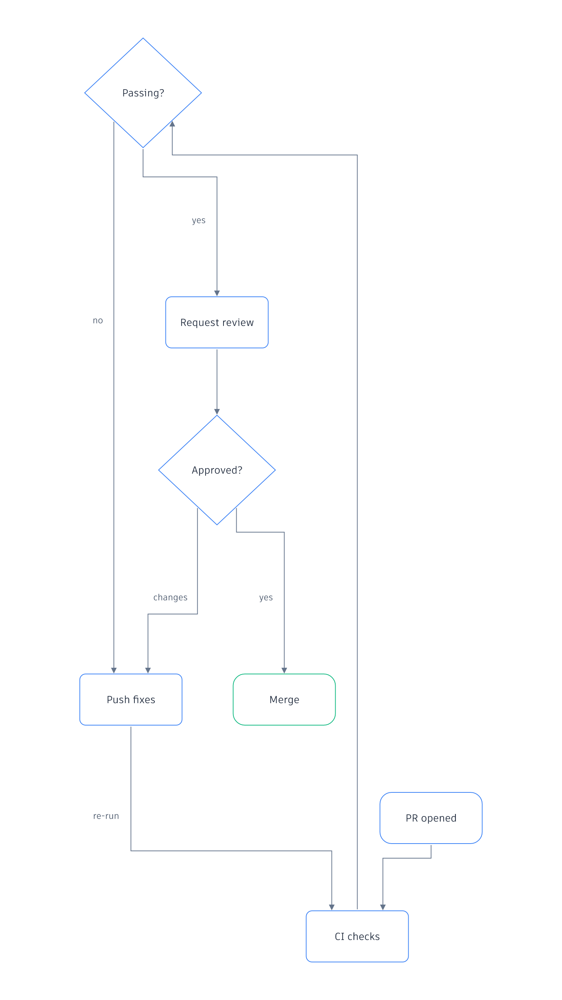

[`00_sketch_architecture.json`](./00_sketch_architecture.json) (sketch) · [`00_minimal_flowchart.json`](./00_minimal_flowchart.json) (minimal)

---

## Architecture

Nested VPCs / clusters (`groupId`), FontAwesome icons, colored nodes, labeled edges.

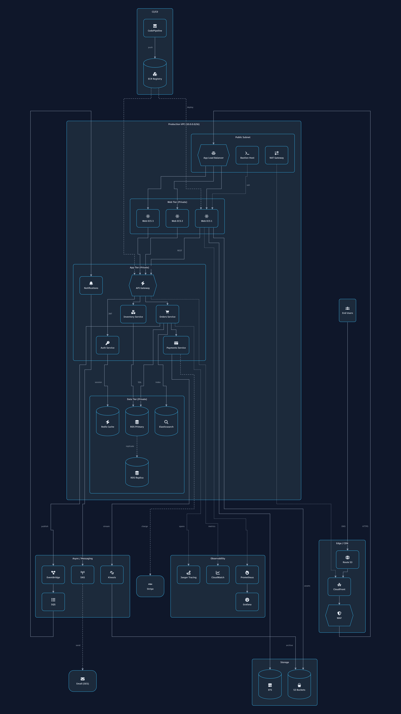

[`01_cloud_architecture.json`](./01_cloud_architecture.json) · [`14_microservices_k8s.json`](./14_microservices_k8s.json) · [`13_star_wars_battle.json`](./13_star_wars_battle.json) · [`32_production_platform_architecture.json`](./32_production_platform_architecture.json)

The last one is deliberately large — **44 nodes across four nested tiers with 38 edges**. This is the range where hand-drawing SVG breaks down: a model can place the boxes, but edge routing turns into diagonal lines cutting through other shapes, and the result can't be edited without regenerating it. A real layout engine nests the clusters and routes around obstacles, and the JSON stays an editable source of truth.

## C4 Context

C4 element kinds (person / system / external / container / database / boundary) with `[technology]` on relationships.

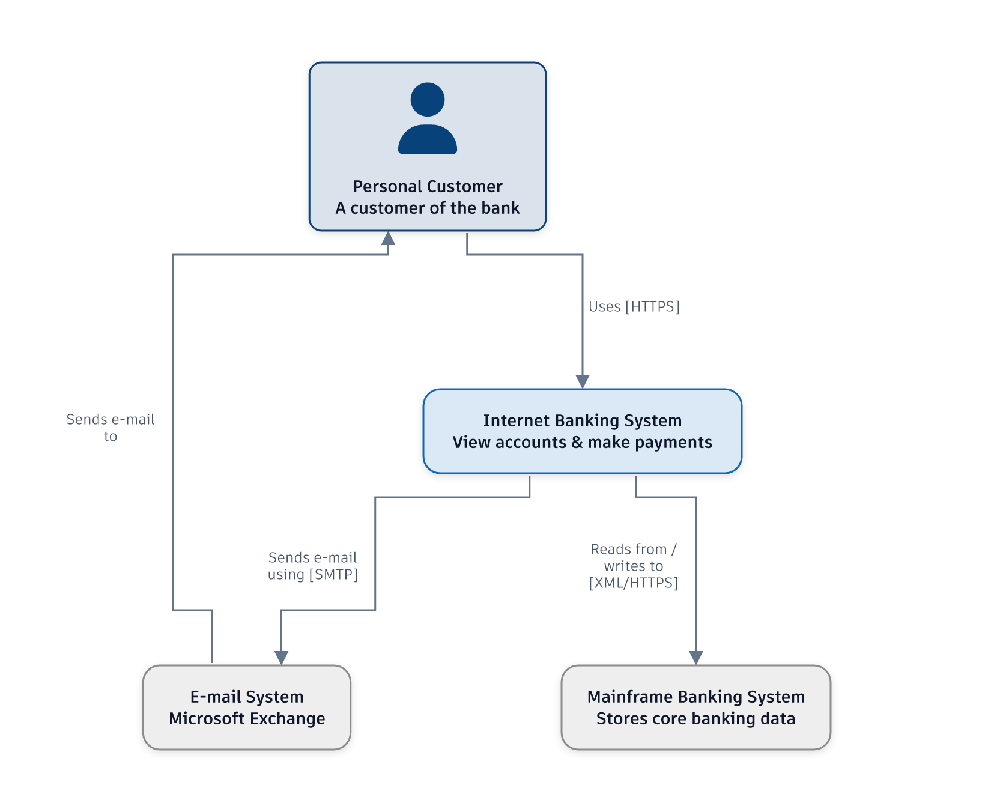

[`29_banking_c4_context.json`](./29_banking_c4_context.json)

## Flowchart

Shapes, decision diamonds, branch labels — shown here with the built-in **dark** theme.

[`04_oauth_flowchart.json`](./04_oauth_flowchart.json) · [`31_dark_cicd_pipeline.json`](./31_dark_cicd_pipeline.json)

## Sequence

Participants, lifelines, sync / async / return messages, self-messages.

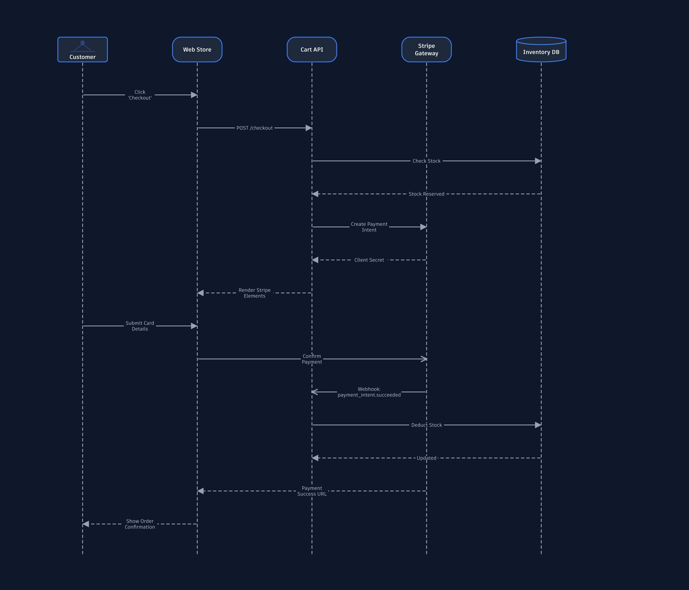

[`02_ecommerce_checkout_sequence.json`](./02_ecommerce_checkout_sequence.json) · [`15_coffee_shop_sequence.json`](./15_coffee_shop_sequence.json)

## State Machine

Initial / final / composite states and labeled transitions.

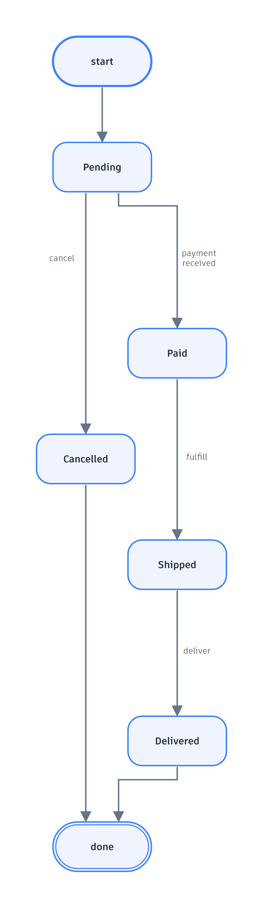

[`22_order_state_machine.json`](./22_order_state_machine.json)

## ERD

Entities with PK/FK attributes rendered as tables, relationships with **crow's-foot** cardinality markers.

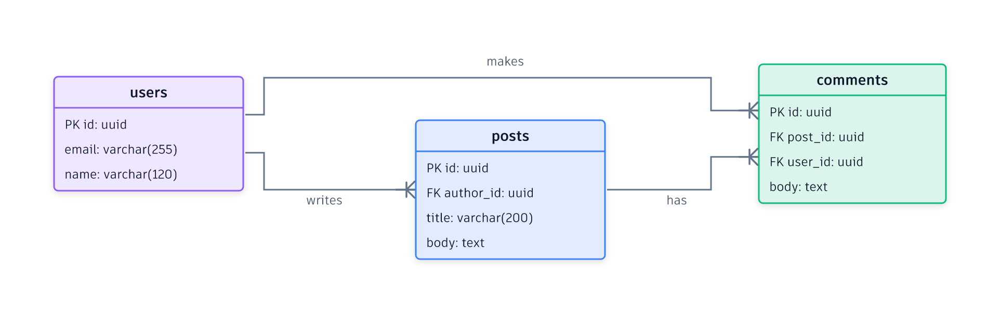

[`23_blog_erd.json`](./23_blog_erd.json)

## UML Class

Classes with attribute / method compartments and UML relationship markers (inheritance, composition, aggregation, dependency).

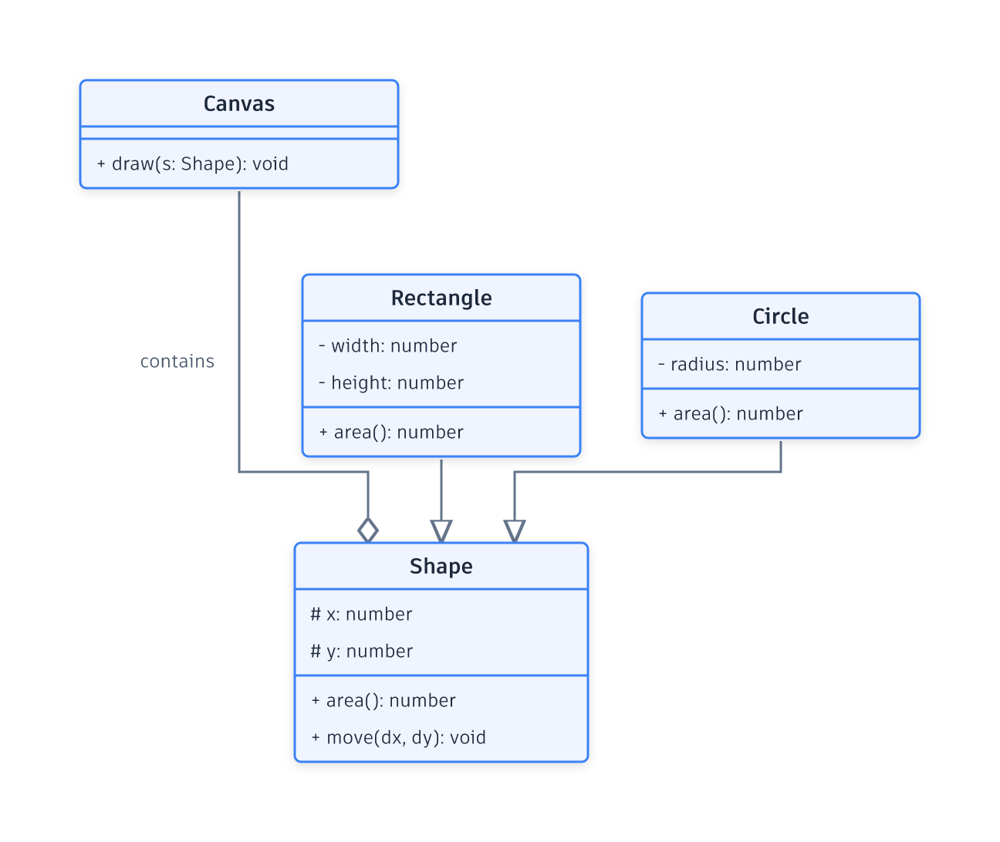

[`24_shapes_class_diagram.json`](./24_shapes_class_diagram.json)

## Mindmap

Radial layout with branch coloring and icons.

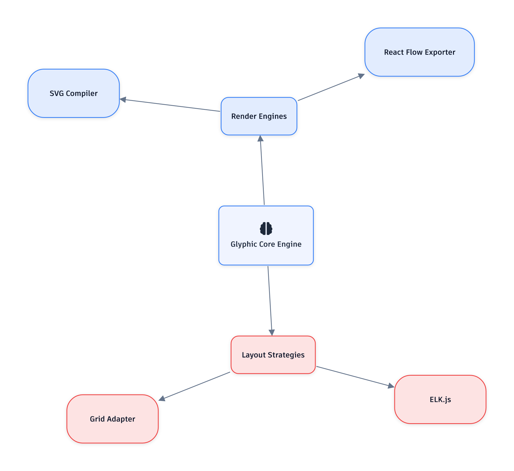

[`09_product_mindmap.json`](./09_product_mindmap.json) · [`17_ai_startup_mindmap.json`](./17_ai_startup_mindmap.json)

## Gantt

Sections, tasks with start/duration/dependencies, a time axis, and dependency arrows.

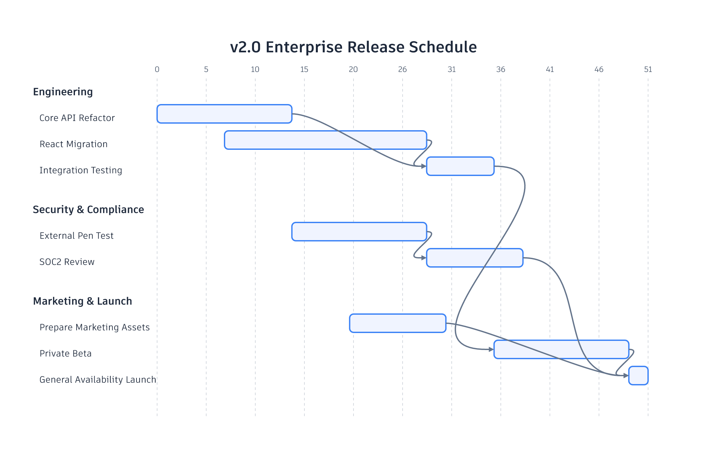

[`05_software_release_gantt.json`](./05_software_release_gantt.json) · [`18_mars_mission_gantt.json`](./18_mars_mission_gantt.json)

## Timeline

Chronological periods, each a colored column of event cards.

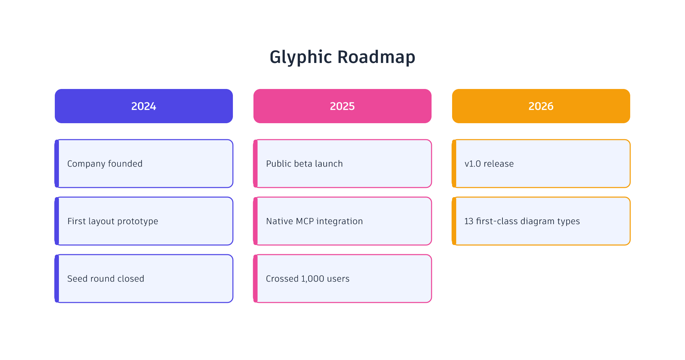

[`25_product_timeline.json`](./25_product_timeline.json)

## User Journey

Stages → task cards tinted by a 1–5 satisfaction score, with actors.

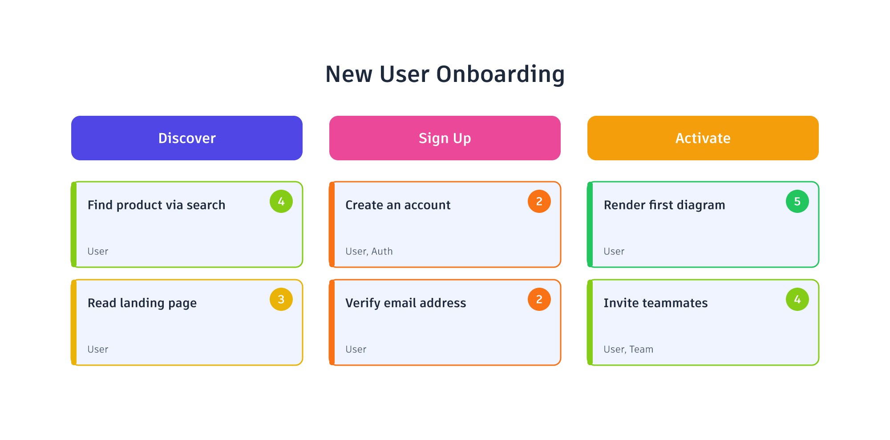

[`26_onboarding_journey.json`](./26_onboarding_journey.json)

## Kanban

Columns of cards with priority accent, assignee, and tags.

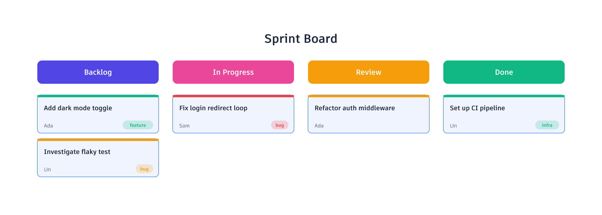

[`28_sprint_kanban.json`](./28_sprint_kanban.json)

## Pie

Slices with leader-line labels, explode offsets, and an optional color legend (`"legend": true`).

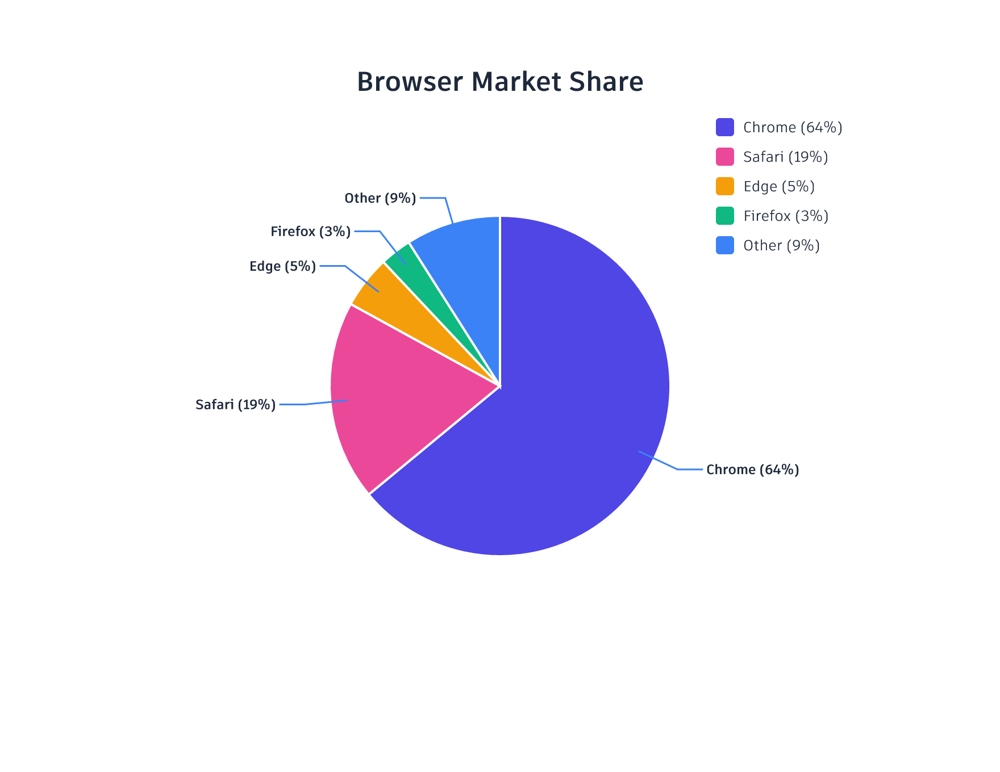

[`07_market_share_pie.json`](./07_market_share_pie.json) · [`20_developer_time_pie.json`](./20_developer_time_pie.json) · [`27_browser_share_pie.json`](./27_browser_share_pie.json)

## Quadrant

2×2 matrix with axis labels and de-conflicted point labels.

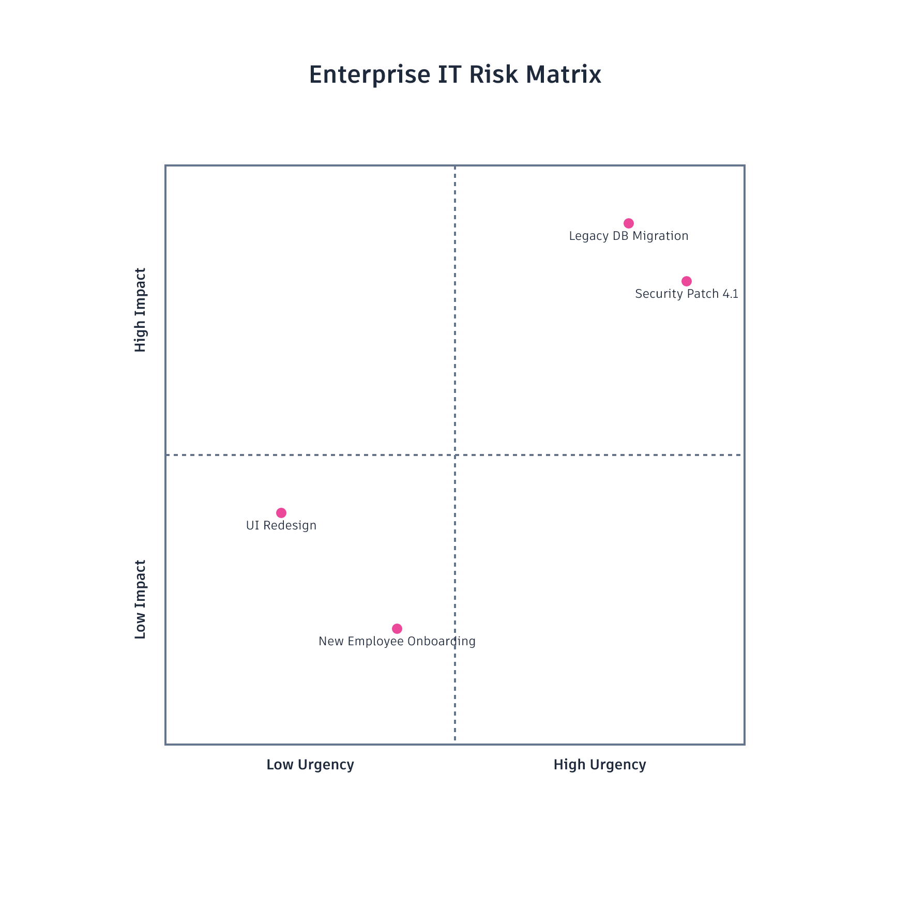

[`08_risk_quadrant.json`](./08_risk_quadrant.json) · [`21_programming_lang_quadrant.json`](./21_programming_lang_quadrant.json)

## Sankey

Proportional flows via `d3-sankey`.

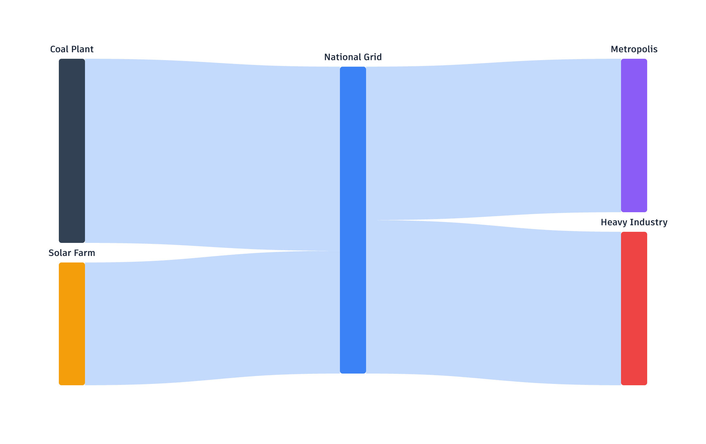

[`10_energy_sankey.json`](./10_energy_sankey.json) · [`16_startup_funding_sankey.json`](./16_startup_funding_sankey.json)

## Git Graph

Branches as lanes, merges, and tags.

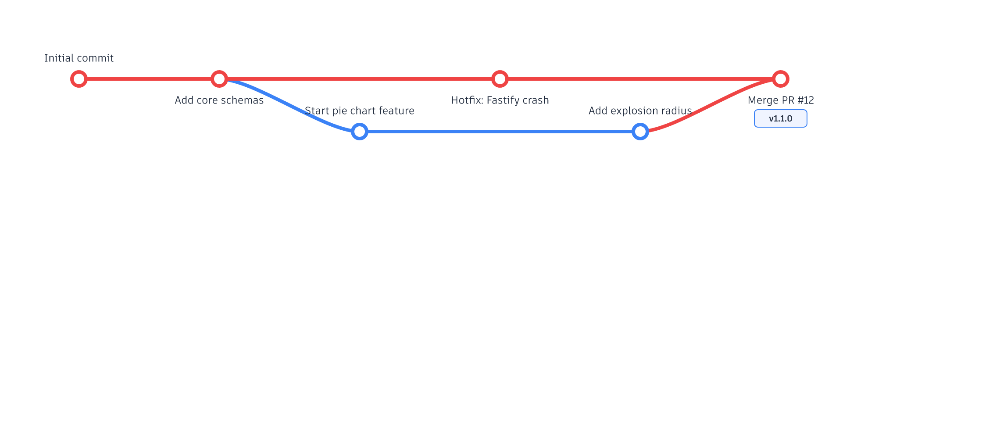

[`11_git_history.json`](./11_git_history.json) · [`12_complex_git_history.json`](./12_complex_git_history.json)

## Treemap

Hierarchical value rectangles (squarified, via `d3-hierarchy`), colored by top-level group.

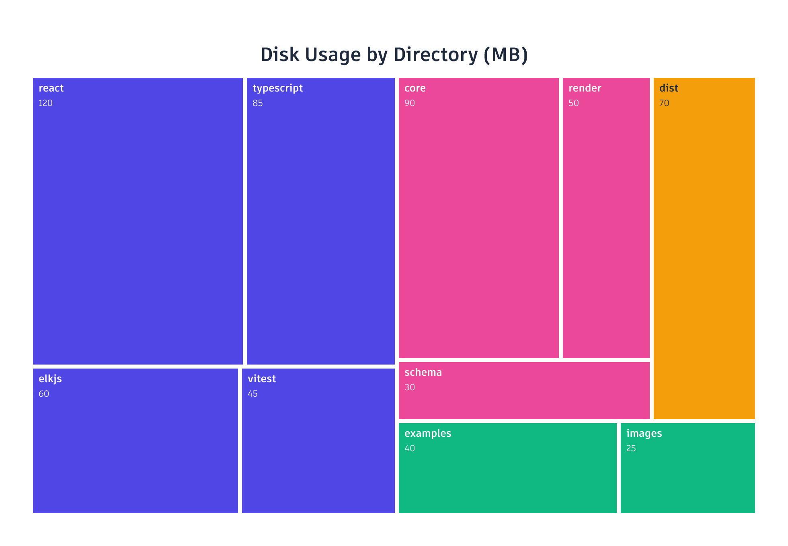

[`30_disk_usage_treemap.json`](./30_disk_usage_treemap.json)

## Canvas (freeform)

Absolute-positioned SVG primitives (rect / circle / text / path / group / raw-svg) for fully custom visuals.

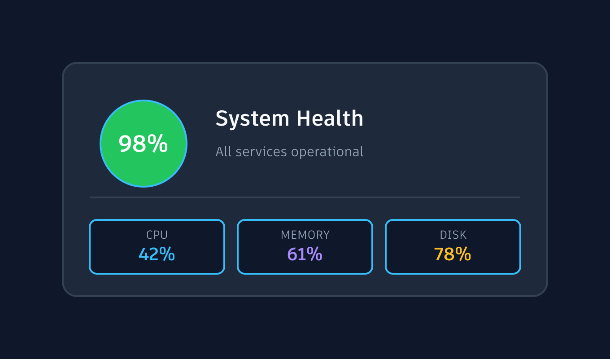

[`00_freeform_canvas.json`](./00_freeform_canvas.json)
