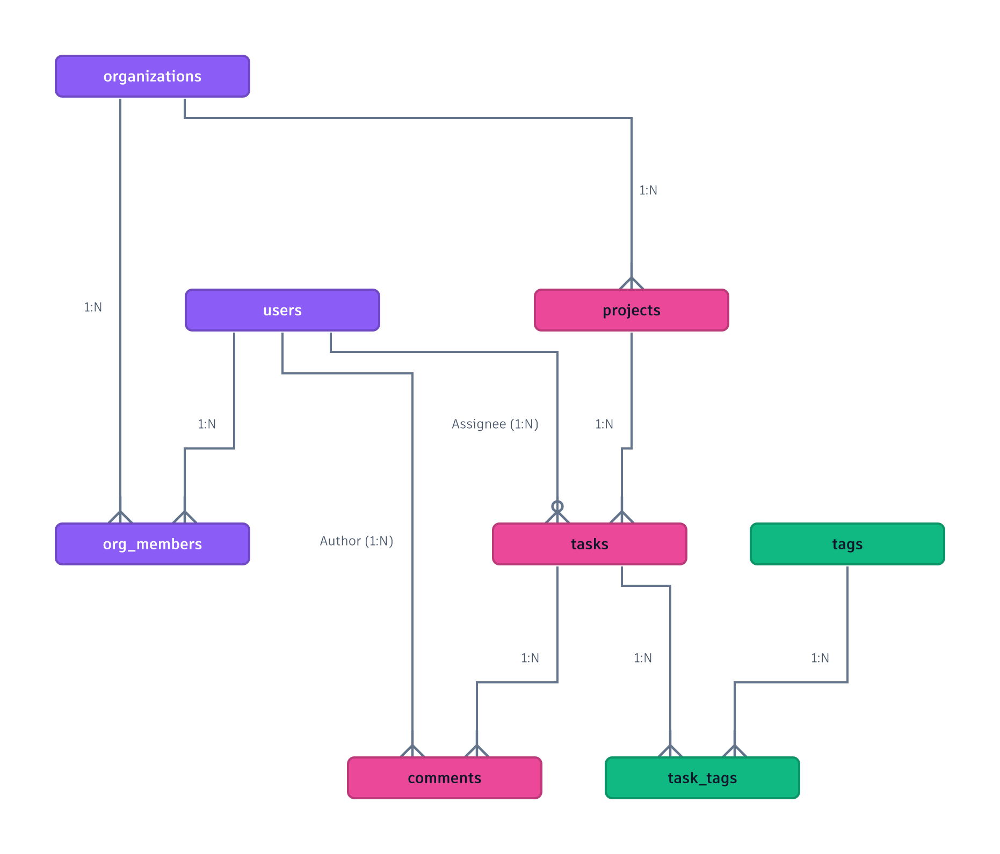
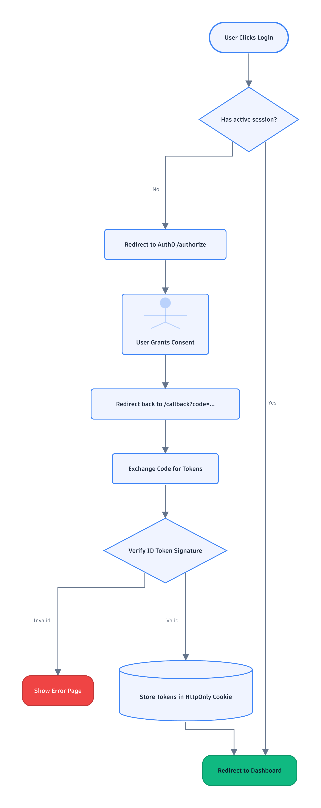
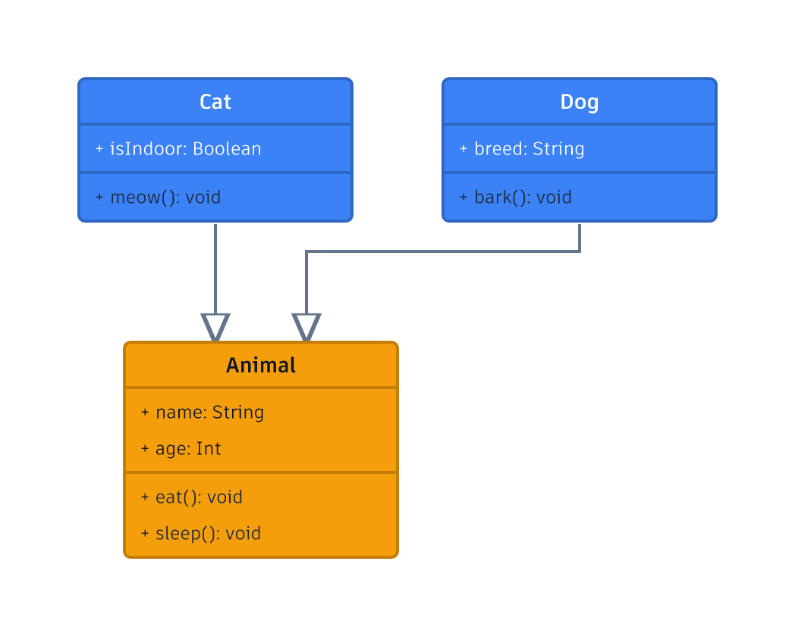
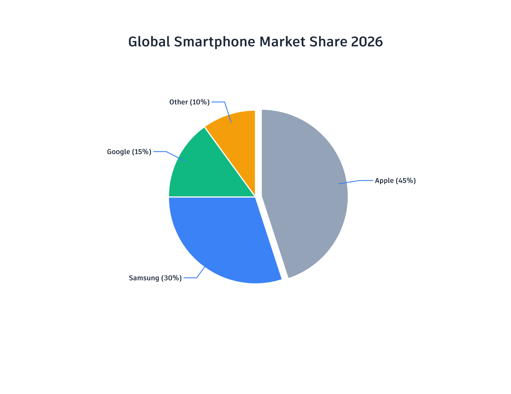

# Examples Gallery

Here are 11 complex examples generated entirely via the `@glyphic/core` mathematically-routed rendering engine. None of these use headless browsers or Mermaid.js.

## 01 cloud architecture


<details><summary>View Semantic JSON</summary>

```json
{
  "type": "architecture",
  "theme": {
    "fontFamily": "Outfit"
  },
  "nodes": [
    {
      "id": "users",
      "label": "External Users",
      "shape": "person",
      "icon": "fas-users"
    },
    {
      "id": "cdn",
      "label": "CloudFront CDN",
      "shape": "cloud",
      "icon": "fas-bolt"
    },
    {
      "id": "vpc",
      "label": "Production VPC",
      "shape": "rectangle"
    },
    {
      "id": "alb",
      "label": "Application Load Balancer",
      "shape": "rectangle",
      "groupId": "vpc",
      "icon": "fas-network-wired"
    },
    {
      "id": "api_cluster",
      "label": "API ECS Cluster",
      "shape": "rectangle",
      "groupId": "vpc"
    },
    {
      "id": "auth_svc",
      "label": "Auth Service",
      "shape": "rectangle",
      "groupId": "api_cluster",
      "icon": "fas-lock"
    },
    {
      "id": "billing_svc",
      "label": "Billing Service",
      "shape": "rectangle",
      "groupId": "api_cluster",
      "icon": "fas-credit-card"
    },
    {
      "id": "db_cluster",
      "label": "Database Cluster",
      "shape": "rectangle",
      "groupId": "vpc"
    },
    {
      "id": "pg_master",
      "label": "Postgres Primary",
      "shape": "database",
      "groupId": "db_cluster",
      "icon": "fas-database",
      "metadata": {
        "color": "#3b82f6"
      }
    },
    {
      "id": "pg_replica",
      "label": "Postgres Replica",
      "shape": "database",
      "groupId": "db_cluster",
      "icon": "fas-database"
    },
    {
      "id": "redis",
      "label": "Redis Cache",
      "shape": "cylinder",
      "groupId": "db_cluster",
      "icon": "fas-memory",
      "metadata": {
        "color": "#ef4444"
      }
    },
    {
      "id": "s3",
      "label": "S3 Storage",
      "shape": "cylinder",
      "icon": "fas-archive",
      "metadata": {
        "color": "#10b981"
      }
    }
  ],
  "edges": [
    {
      "source": "users",
      "target": "cdn",
      "label": "HTTPS"
    },
    {
      "source": "cdn",
      "target": "alb",
      "label": "Forward Cache Miss"
    },
    {
      "source": "alb",
      "target": "auth_svc",
      "label": "/auth"
    },
    {
      "source": "alb",
      "target": "billing_svc",
      "label": "/billing"
    },
    {
      "source": "auth_svc",
      "target": "pg_master",
      "label": "Read/Write Users"
    },
    {
      "source": "billing_svc",
      "target": "pg_master",
      "label": "Read/Write Invoices"
    },
    {
      "source": "auth_svc",
      "target": "redis",
      "label": "Session Cache"
    },
    {
      "source": "pg_master",
      "target": "pg_replica",
      "label": "Async Replication",
      "style": "dashed"
    },
    {
      "source": "billing_svc",
      "target": "s3",
      "label": "Store PDF Receipts"
    },
    {
      "source": "cdn",
      "target": "s3",
      "label": "Serve Static Assets"
    }
  ]
}
```

</details>

---

## 02 ecommerce checkout sequence


<details><summary>View Semantic JSON</summary>

```json
{
  "type": "sequence",
  "theme": {
    "background": "#0f172a",
    "nodeBackground": "#1e293b",
    "nodeBorder": "#3b82f6",
    "nodeText": "#f8fafc",
    "edgeColor": "#94a3b8",
    "edgeLabelColor": "#cbd5e1"
  },
  "participants": [
    {
      "id": "user",
      "label": "Customer",
      "shape": "actor"
    },
    {
      "id": "frontend",
      "label": "Web Store",
      "shape": "service"
    },
    {
      "id": "cart_api",
      "label": "Cart API",
      "shape": "service"
    },
    {
      "id": "stripe",
      "label": "Stripe Gateway",
      "shape": "service"
    },
    {
      "id": "inventory",
      "label": "Inventory DB",
      "shape": "database"
    }
  ],
  "messages": [
    {
      "source": "user",
      "target": "frontend",
      "label": "Click 'Checkout'",
      "type": "sync"
    },
    {
      "source": "frontend",
      "target": "cart_api",
      "label": "POST /checkout",
      "type": "sync"
    },
    {
      "source": "cart_api",
      "target": "inventory",
      "label": "Check Stock",
      "type": "sync"
    },
    {
      "source": "inventory",
      "target": "cart_api",
      "label": "Stock Reserved",
      "type": "return"
    },
    {
      "source": "cart_api",
      "target": "stripe",
      "label": "Create Payment Intent",
      "type": "sync"
    },
    {
      "source": "stripe",
      "target": "cart_api",
      "label": "Client Secret",
      "type": "return"
    },
    {
      "source": "cart_api",
      "target": "frontend",
      "label": "Render Stripe Elements",
      "type": "return"
    },
    {
      "source": "user",
      "target": "frontend",
      "label": "Submit Card Details",
      "type": "sync"
    },
    {
      "source": "frontend",
      "target": "stripe",
      "label": "Confirm Payment",
      "type": "async"
    },
    {
      "source": "stripe",
      "target": "cart_api",
      "label": "Webhook: payment_intent.succeeded",
      "type": "async"
    },
    {
      "source": "cart_api",
      "target": "inventory",
      "label": "Deduct Stock",
      "type": "sync"
    },
    {
      "source": "inventory",
      "target": "cart_api",
      "label": "Updated",
      "type": "return"
    },
    {
      "source": "stripe",
      "target": "frontend",
      "label": "Payment Success URL",
      "type": "return"
    },
    {
      "source": "frontend",
      "target": "user",
      "label": "Show Order Confirmation",
      "type": "return"
    }
  ]
}
```

</details>

---

## 03 complex erd



<details><summary>View Semantic JSON</summary>

```json
{
  "type": "architecture",
  "theme": {
    "fontFamily": "Fira Code"
  },
  "nodes": [
    {
      "id": "users",
      "label": "users",
      "shape": "table",
      "metadata": {
        "color": "#8b5cf6"
      }
    },
    {
      "id": "organizations",
      "label": "organizations",
      "shape": "table",
      "metadata": {
        "color": "#8b5cf6"
      }
    },
    {
      "id": "org_members",
      "label": "org_members",
      "shape": "table",
      "metadata": {
        "color": "#8b5cf6"
      }
    },
    {
      "id": "projects",
      "label": "projects",
      "shape": "table",
      "metadata": {
        "color": "#ec4899"
      }
    },
    {
      "id": "tasks",
      "label": "tasks",
      "shape": "table",
      "metadata": {
        "color": "#ec4899"
      }
    },
    {
      "id": "comments",
      "label": "comments",
      "shape": "table",
      "metadata": {
        "color": "#ec4899"
      }
    },
    {
      "id": "tags",
      "label": "tags",
      "shape": "table",
      "metadata": {
        "color": "#10b981"
      }
    },
    {
      "id": "task_tags",
      "label": "task_tags",
      "shape": "table",
      "metadata": {
        "color": "#10b981"
      }
    }
  ],
  "edges": [
    {
      "source": "organizations",
      "target": "org_members",
      "label": "1:N",
      "arrow": "crow"
    },
    {
      "source": "users",
      "target": "org_members",
      "label": "1:N",
      "arrow": "crow"
    },
    {
      "source": "organizations",
      "target": "projects",
      "label": "1:N",
      "arrow": "crow"
    },
    {
      "source": "projects",
      "target": "tasks",
      "label": "1:N",
      "arrow": "crow"
    },
    {
      "source": "users",
      "target": "tasks",
      "label": "Assignee (1:N)",
      "arrow": "crow-zero-many"
    },
    {
      "source": "tasks",
      "target": "comments",
      "label": "1:N",
      "arrow": "crow"
    },
    {
      "source": "users",
      "target": "comments",
      "label": "Author (1:N)",
      "arrow": "crow"
    },
    {
      "source": "tasks",
      "target": "task_tags",
      "label": "1:N",
      "arrow": "crow"
    },
    {
      "source": "tags",
      "target": "task_tags",
      "label": "1:N",
      "arrow": "crow"
    }
  ]
}
```

</details>

---

## 04 oauth flowchart



<details><summary>View Semantic JSON</summary>

```json
{
  "type": "flowchart",
  "nodes": [
    {
      "id": "start",
      "label": "User Clicks Login",
      "shape": "state_start"
    },
    {
      "id": "check_session",
      "label": "Has active session?",
      "shape": "diamond"
    },
    {
      "id": "dashboard",
      "label": "Redirect to Dashboard",
      "shape": "rounded",
      "metadata": {
        "color": "#10b981"
      }
    },
    {
      "id": "redirect_auth",
      "label": "Redirect to Auth0 /authorize",
      "shape": "rectangle"
    },
    {
      "id": "user_consent",
      "label": "User Grants Consent",
      "shape": "person"
    },
    {
      "id": "callback",
      "label": "Redirect back to /callback?code=...",
      "shape": "rectangle"
    },
    {
      "id": "exchange",
      "label": "Exchange Code for Tokens",
      "shape": "rectangle"
    },
    {
      "id": "verify",
      "label": "Verify ID Token Signature",
      "shape": "diamond"
    },
    {
      "id": "error",
      "label": "Show Error Page",
      "shape": "rounded",
      "metadata": {
        "color": "#ef4444"
      }
    },
    {
      "id": "store",
      "label": "Store Tokens in HttpOnly Cookie",
      "shape": "cylinder"
    }
  ],
  "edges": [
    {
      "source": "start",
      "target": "check_session"
    },
    {
      "source": "check_session",
      "target": "dashboard",
      "label": "Yes"
    },
    {
      "source": "check_session",
      "target": "redirect_auth",
      "label": "No"
    },
    {
      "source": "redirect_auth",
      "target": "user_consent"
    },
    {
      "source": "user_consent",
      "target": "callback"
    },
    {
      "source": "callback",
      "target": "exchange"
    },
    {
      "source": "exchange",
      "target": "verify"
    },
    {
      "source": "verify",
      "target": "store",
      "label": "Valid"
    },
    {
      "source": "verify",
      "target": "error",
      "label": "Invalid"
    },
    {
      "source": "store",
      "target": "dashboard"
    }
  ]
}
```

</details>

---

## 05 software release gantt


<details><summary>View Semantic JSON</summary>

```json
{
  "type": "gantt",
  "title": "v2.0 Enterprise Release Schedule",
  "sections": [
    {
      "label": "Engineering",
      "tasks": [
        {
          "id": "core",
          "label": "Core API Refactor",
          "start": 0,
          "duration": 14
        },
        {
          "id": "frontend",
          "label": "React Migration",
          "start": 7,
          "duration": 21
        },
        {
          "id": "qa_eng",
          "label": "Integration Testing",
          "start": 28,
          "duration": 7,
          "dependencies": [
            "core",
            "frontend"
          ]
        }
      ]
    },
    {
      "label": "Security & Compliance",
      "tasks": [
        {
          "id": "audit",
          "label": "External Pen Test",
          "start": 14,
          "duration": 14
        },
        {
          "id": "soc2",
          "label": "SOC2 Review",
          "start": 28,
          "duration": 10,
          "dependencies": [
            "audit"
          ]
        }
      ]
    },
    {
      "label": "Marketing & Launch",
      "tasks": [
        {
          "id": "assets",
          "label": "Prepare Marketing Assets",
          "start": 20,
          "duration": 10
        },
        {
          "id": "beta",
          "label": "Private Beta",
          "start": 35,
          "duration": 14,
          "dependencies": [
            "qa_eng"
          ]
        },
        {
          "id": "ga",
          "label": "General Availability Launch",
          "start": 49,
          "duration": 2,
          "dependencies": [
            "beta",
            "soc2",
            "assets"
          ]
        }
      ]
    }
  ]
}
```

</details>

---

## 06 uml class diagram



<details><summary>View Semantic JSON</summary>

```json
{
  "type": "architecture",
  "theme": {
    "fontFamily": "Fira Code"
  },
  "nodes": [
    {
      "id": "animal",
      "label": "Animal",
      "shape": "class",
      "metadata": {
        "color": "#f59e0b",
        "attributes": [
          "+ name: String",
          "+ age: Int"
        ],
        "methods": [
          "+ eat(): void",
          "+ sleep(): void"
        ]
      }
    },
    {
      "id": "dog",
      "label": "Dog",
      "shape": "class",
      "metadata": {
        "color": "#3b82f6",
        "attributes": [
          "+ breed: String"
        ],
        "methods": [
          "+ bark(): void"
        ]
      }
    },
    {
      "id": "cat",
      "label": "Cat",
      "shape": "class",
      "metadata": {
        "color": "#3b82f6",
        "attributes": [
          "+ isIndoor: Boolean"
        ],
        "methods": [
          "+ meow(): void"
        ]
      }
    }
  ],
  "edges": [
    {
      "source": "dog",
      "target": "animal",
      "arrow": "inheritance"
    },
    {
      "source": "cat",
      "target": "animal",
      "arrow": "inheritance"
    }
  ]
}
```

</details>

---

## 07 market share pie



<details><summary>View Semantic JSON</summary>

```json
{
  "type": "pie",
  "title": "Global Smartphone Market Share 2026",
  "data": [
    {
      "label": "Apple",
      "value": 45,
      "color": "#94a3b8",
      "explode": 10
    },
    {
      "label": "Samsung",
      "value": 30,
      "color": "#3b82f6"
    },
    {
      "label": "Google",
      "value": 15,
      "color": "#10b981"
    },
    {
      "label": "Other",
      "value": 10,
      "color": "#f59e0b"
    }
  ]
}
```

</details>

---

## 08 risk quadrant


<details><summary>View Semantic JSON</summary>

```json
{
  "type": "quadrant",
  "title": "Enterprise IT Risk Matrix",
  "xAxis": {
    "left": "Low Urgency",
    "right": "High Urgency"
  },
  "yAxis": {
    "bottom": "Low Impact",
    "top": "High Impact"
  },
  "points": [
    {
      "label": "Legacy DB Migration",
      "x": 0.8,
      "y": 0.9
    },
    {
      "label": "UI Redesign",
      "x": 0.2,
      "y": 0.4
    },
    {
      "label": "Security Patch 4.1",
      "x": 0.9,
      "y": 0.8
    },
    {
      "label": "New Employee Onboarding",
      "x": 0.4,
      "y": 0.2
    }
  ]
}
```

</details>

---

## 09 product mindmap


<details><summary>View Semantic JSON</summary>

```json
{
  "type": "mindmap",
  "nodes": [
    {
      "id": "core",
      "label": "Glyphic Core Engine",
      "shape": "rectangle",
      "icon": "fas-brain"
    },
    {
      "id": "layout",
      "label": "Layout Strategies",
      "shape": "rounded"
    },
    {
      "id": "render",
      "label": "Render Engines",
      "shape": "rounded"
    },
    {
      "id": "elk",
      "label": "ELK.js",
      "shape": "cloud"
    },
    {
      "id": "grid",
      "label": "Grid Adapter",
      "shape": "cloud"
    },
    {
      "id": "svg",
      "label": "SVG Compiler",
      "shape": "cloud"
    },
    {
      "id": "react",
      "label": "React Flow Exporter",
      "shape": "cloud"
    }
  ],
  "edges": [
    {
      "source": "core",
      "target": "layout"
    },
    {
      "source": "core",
      "target": "render"
    },
    {
      "source": "layout",
      "target": "elk"
    },
    {
      "source": "layout",
      "target": "grid"
    },
    {
      "source": "render",
      "target": "svg"
    },
    {
      "source": "render",
      "target": "react"
    }
  ]
}
```

</details>

---

## 10 energy sankey


<details><summary>View Semantic JSON</summary>

```json
{
  "type": "sankey",
  "nodes": [
    {
      "id": "coal",
      "label": "Coal Plant",
      "color": "#334155"
    },
    {
      "id": "solar",
      "label": "Solar Farm",
      "color": "#f59e0b"
    },
    {
      "id": "grid",
      "label": "National Grid",
      "color": "#3b82f6"
    },
    {
      "id": "city",
      "label": "Metropolis",
      "color": "#8b5cf6"
    },
    {
      "id": "industry",
      "label": "Heavy Industry",
      "color": "#ef4444"
    }
  ],
  "edges": [
    {
      "source": "coal",
      "target": "grid",
      "value": 60
    },
    {
      "source": "solar",
      "target": "grid",
      "value": 40
    },
    {
      "source": "grid",
      "target": "city",
      "value": 50
    },
    {
      "source": "grid",
      "target": "industry",
      "value": 50
    }
  ]
}
```

</details>

---

## 11 git history


<details><summary>View Semantic JSON</summary>

```json
{
  "type": "git",
  "commits": [
    {
      "id": "c1",
      "message": "Initial commit",
      "branch": "main"
    },
    {
      "id": "c2",
      "message": "Add core schemas",
      "branch": "main",
      "parents": [
        "c1"
      ]
    },
    {
      "id": "f1",
      "message": "Start pie chart feature",
      "branch": "feature/pie",
      "parents": [
        "c2"
      ]
    },
    {
      "id": "c3",
      "message": "Hotfix: Fastify crash",
      "branch": "main",
      "parents": [
        "c2"
      ]
    },
    {
      "id": "f2",
      "message": "Add explosion radius",
      "branch": "feature/pie",
      "parents": [
        "f1"
      ]
    },
    {
      "id": "c4",
      "message": "Merge PR #12",
      "branch": "main",
      "parents": [
        "c3",
        "f2"
      ],
      "tag": "v1.1.0"
    }
  ]
}
```

</details>

---

